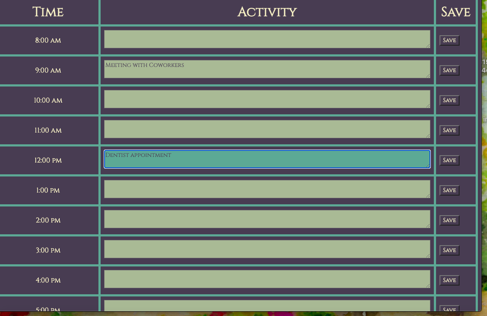

# Work-Day-Schedule

Day schedule of working hours that allows for user input text and is color-coded to indicate whether the time block on the schedule is current, in the past, or in the future.

## Criteria met

- day.js was used for current time and date information

* schedule displays and current day, date, and time are displayed above

* textarea time block display changes color based on time of day depending on whether the time block
    is in the past, present, or future
* user clicks into time block they wish to schedule into, color of text area changes, and user can input text

## Criteria not met

- Save button does not save text input to local storage

- On page refresh, saved events do not persist

## SCREENSHOT

